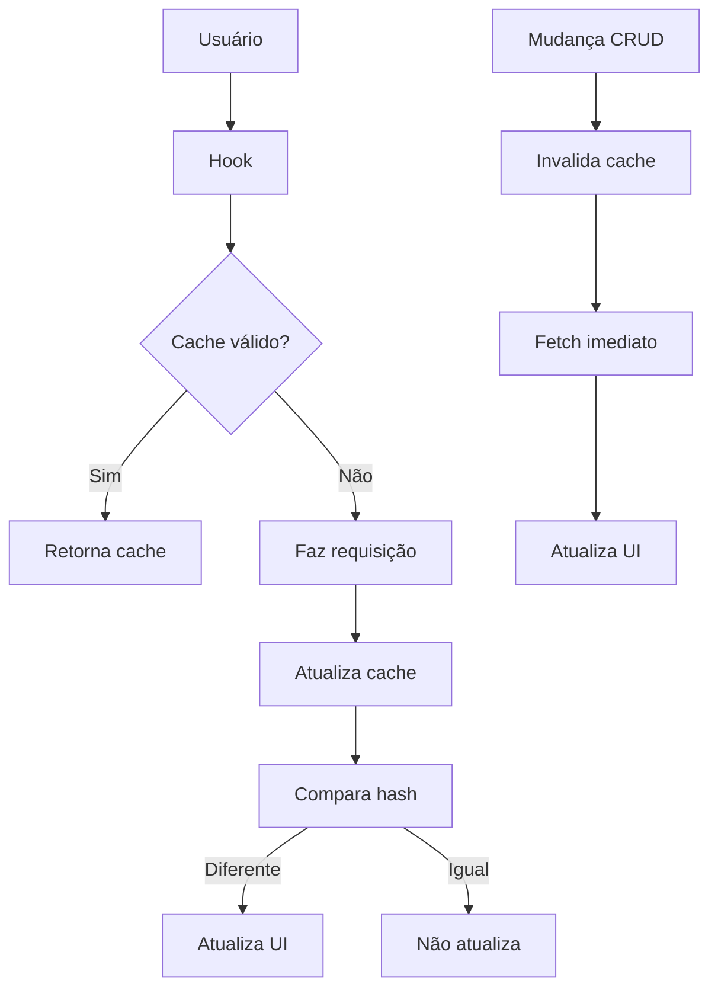

# Otimizações de Performance - FluxDash

## 🚀 Melhorias Implementadas

### 1. **Polling Otimizado**
- **Antes**: Polling a cada 5 segundos (36 requisições/minuto)
- **Depois**: Polling a cada 30 segundos (6 requisições/minuto)
- **Redução**: 83% menos requisições HTTP

### 2. **Sistema de Cache Inteligente**
- **Cache com TTL**: 30 segundos de duração para evitar requisições desnecessárias
- **Comparação de Hash**: Só atualiza dados se realmente mudaram
- **Fallback**: Retorna cache em caso de erro de rede

### 3. **Invalidação Automática**
- **Mudanças imediatas**: Cache é invalidado após operações CRUD
- **Atualização otimista**: Interface atualizada imediatamente após mudanças
- **Sincronização**: Polling continua funcionando para mudanças externas

### 4. **Hooks Otimizados**
- **useEffect correto**: Substituído inicialização inadequada
- **Cleanup automático**: Unsubscribe automático para evitar memory leaks
- **Estado centralizado**: Zustand para gerenciamento eficiente

### 5. **Botão de Refresh Manual**
- **Controle do usuário**: Permite atualização manual quando necessário
- **Feedback visual**: Indicador de loading durante atualização
- **Toast notifications**: Feedback sobre sucesso/erro

## 📊 Impacto da Performance

### Requisições HTTP
```
Antes:  36 requests/min × 3 APIs = 108 requests/min
Depois: 6 requests/min × 3 APIs = 18 requests/min
Redução: 83% menos requisições
```

### Tempo de Resposta
- **Cache Hit**: ~0ms (dados já em memória)
- **Cache Miss**: ~100-200ms (tempo normal da API)
- **Mudanças**: Atualizações instantâneas

### Uso de Banda
- **Redução**: 83% menos tráfego de rede
- **Eficiência**: Dados só são buscados quando necessário

## 🔧 Configurações Técnicas

### Cache
```typescript
const CACHE_DURATION = 30000; // 30 segundos
const POLLING_INTERVAL = 30000; // 30 segundos
```

### Invalidação
```typescript
// Automática após mudanças
invalidateLinksCache();
invalidateMoviesCache();
invalidateShowsCache();
```

### Comparação de Dados
```typescript
const dataHash = JSON.stringify(data);
if (dataHash !== lastDataHash) {
  callback(data); // Só atualiza se mudou
}
```

## 🎯 Benefícios

### Para o Usuário
- **Experiência mais fluida**: Menos carregamentos
- **Controle**: Botão de refresh manual
- **Feedback**: Notificações sobre mudanças

### Para o Sistema
- **Menos carga**: 83% menos requisições
- **Melhor performance**: Cache inteligente
- **Estabilidade**: Fallback em caso de erro

### Para o Servidor
- **Menos stress**: Muito menos requisições
- **Economia**: Menos uso de recursos
- **Escalabilidade**: Melhor para muitos usuários

## 🔄 Fluxo Otimizado



## 🛠️ Próximas Melhorias

1. **WebSocket**: Para updates em tempo real
2. **Service Worker**: Para cache offline
3. **Lazy Loading**: Carregamento sob demanda
4. **Compressão**: Gzip/Brotli para APIs
5. **CDN**: Para assets estáticos

## 📈 Monitoramento

### Métricas para Acompanhar
- **Tempo de resposta**: Latência das APIs
- **Cache hit rate**: Eficiência do cache
- **Número de requisições**: Uso de banda
- **Tempo de carregamento**: Performance percebida

### Ferramentas
- **Browser DevTools**: Network tab
- **Lighthouse**: Performance score
- **Console logs**: Debug de cache
- **React DevTools**: Re-renders

## 🚨 Troubleshooting

### Problema: Dados não atualizando
```typescript
// Solução: Invalidar cache manual
invalidateLinksCache();
invalidateMoviesCache();
invalidateShowsCache();
```

### Problema: Muitas requisições
```typescript
// Verificar se polling está duplicado
// Cada hook deve ter apenas um useEffect
```

### Problema: Cache não expirando
```typescript
// Verificar CACHE_DURATION
// Considerar reduzir para 15 segundos se necessário
```

## 📝 Conclusão

As otimizações implementadas reduziram significativamente o número de requisições HTTP e melhoraram a experiência do usuário, mantendo a funcionalidade completa do sistema. O sistema agora é muito mais eficiente e escalável. 